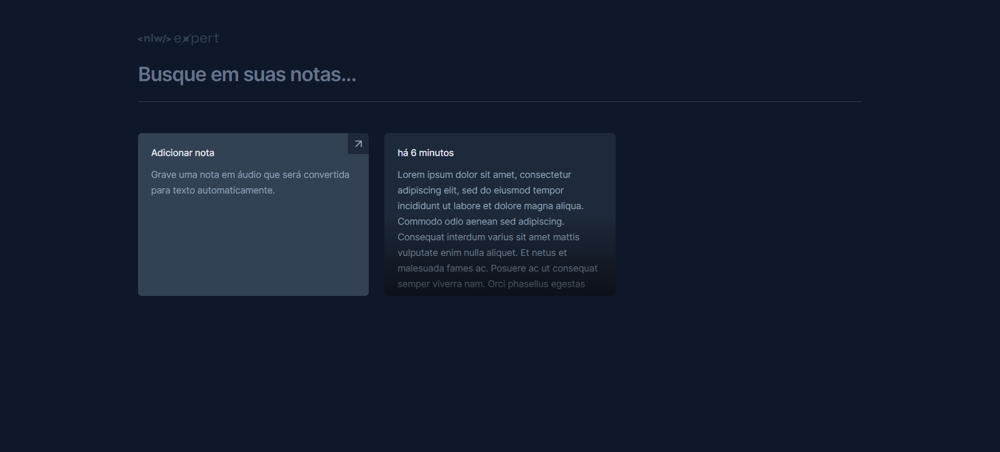
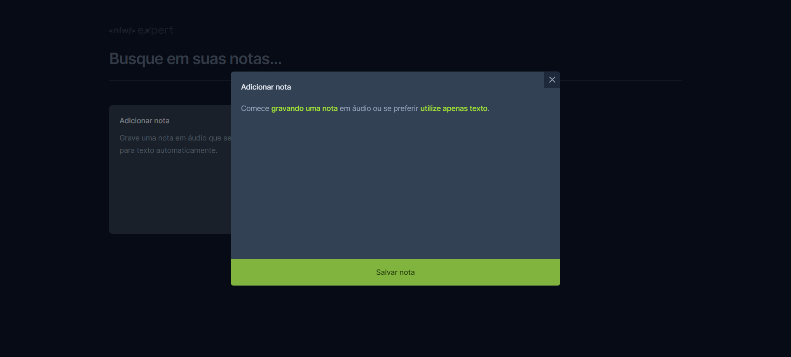
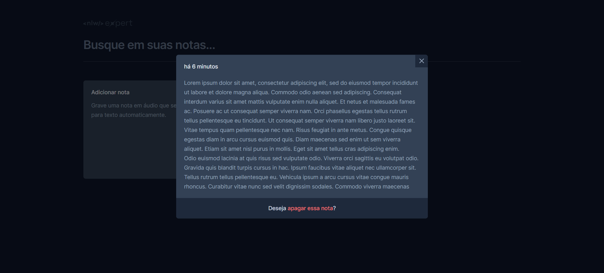

Eae, Dev! 👊🏾

<h3>📌 Sobre</h3> 

O evento NLW Expert é um evento gratuito, ministrado pela [Rocketseat](https://www.rocketseat.com.br/), que veio trazendo várias possibilitades de projeto, em diferentes tecnologias, codando os mesmos de forma completa, introduzindo e aplicando conceitos muito importantes a nível de mercado.  
O projeto Expert Notes foi desenvolvido por meio da trilha React e nele vamos aplicar conceitos fundamentais do ReactJS, construindo uma aplicação de notas, que implementa a API SpeechRecognition, nativa de alguns navegadores, possibilitando escrever notas por voz!

<h3>📌 Tecnologias e bibliotecas</h3> 

- [ReactJS](https://pt-br.react.dev/)
- [TypeScript](https://www.typescriptlang.org/)
- [Tailwind CSS](https://tailwindcss.com/)
- [Vite](https://vitejs.dev/)
- [Sonner](https://sonner.emilkowal.ski/)
- [Lucide](https://lucide.dev/) 
- [Date FNS](https://date-fns.org/)
- [Radix UI](https://www.radix-ui.com/)
- [SpeechRecognitionAPI](https://developer.mozilla.org/en-US/docs/Web/API/SpeechRecognition)
- [Git](https://git-scm.com/)
- [Figma](https://figma.com)

